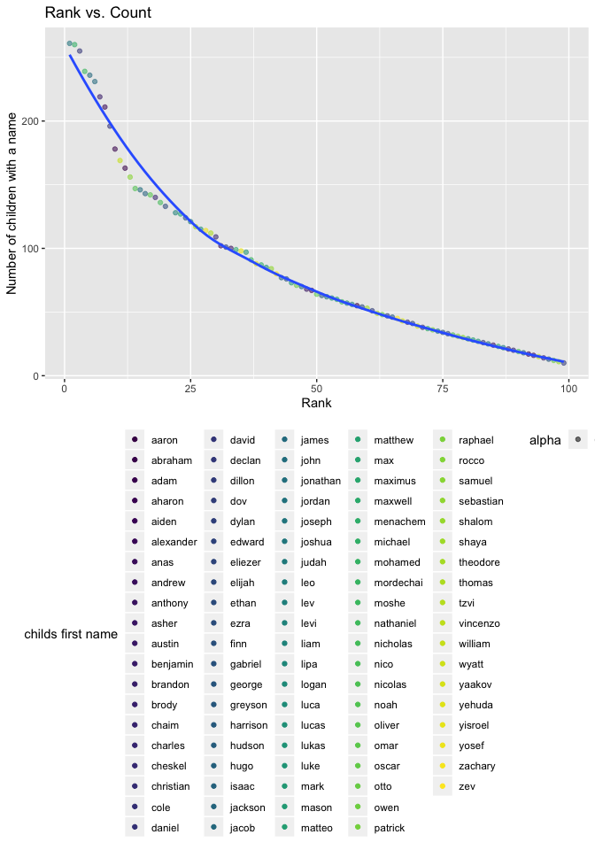

p8105\_hw2\_qilu2370
================
QiLu
9/28/2019

## HW2

\#Problem 1

First, I read data from datasets

``` r
# read data and omit Mr. Trash sheet
sheet_data = read_excel("data/HealthyHarborWaterWheelTotals2018-7-28.xlsx", sheet = "Mr. Trash Wheel", range = "A2:N336")
sheet_data = janitor::clean_names(sheet_data)
sheet_data = na.omit(sheet_data, cols("dumpster"))
sheet_data$sports_balls = as.integer(round(sheet_data$sports_balls))
```

``` r
# read 2018 and 2017 data
data_2018 = read_excel("data/HealthyHarborWaterWheelTotals2018-7-28.xlsx", sheet = "2018 Precipitation", range = "A2:B14") %>%
  mutate(year = "2018")

data_2018 = data_2018%>% drop_na(Total)

data_2017 = read_excel("data/HealthyHarborWaterWheelTotals2018-7-28.xlsx", sheet = "2017 Precipitation", range = "A2:B14") %>%
  mutate(year = "2017")

data_2017 = data_2017%>% drop_na(Total)
```

``` r
#merge them
join_data = full_join(data_2018,data_2017, by = c("Month"))

names(join_data) = c("Month", "Total", "Year", "Total", "Year")
join_data$Month = month.name
```

For the analysis part, the number of observation of dumpsters we saw in
2017 was

``` r
count_data_2017 = filter(sheet_data, year == 2017)
length(count_data_2017$dumpster)
```

    ## [1] 55

the number of observation of dumpsters we saw in 2018 was

``` r
count_data_2018 = filter(sheet_data, year == 2018)
length(count_data_2018$dumpster)
```

    ## [1] 64

The number of dumpsters’ observation increased.

Also, we can know the total precipitation in 2018 was

``` r
total_2018 = replace_na(data_2018$Total, 0)
sum(total_2018)
```

    ## [1] 23.5

the median number of sports balls in a dumpster in 2017 was

``` r
median_data_2017 = filter(sheet_data, year == 2017)
median(median_data_2017$sports_balls)
```

    ## [1] 8

the median number of sports balls in a dumpster in 2018 was

``` r
median_data_2018 = filter(sheet_data, year == 2018)
median(median_data_2018$sports_balls)
```

    ## [1] 3

we saw a significantly decrease.

Finally, the total number of weights in 2017 was

``` r
total_wei_2017 = filter(sheet_data, year == 2017)
sum(total_wei_2017$weight_tons)
```

    ## [1] 174.84

the total number of weights in 2018 was

``` r
total_wei_2018 = filter(sheet_data, year == 2018)
sum(total_wei_2018$weight_tons)
```

    ## [1] 215.36

the total weight we observed increased from 2017 to 2018.

And the total volume cubic yard in 2017 is

``` r
total_vol_2017 = filter(sheet_data, year == 2017)
sum(total_vol_2017$volume_cubic_yards)
```

    ## [1] 885

the total volume cubic yard in 2018 is

``` r
total_vol_2018 = filter(sheet_data, year == 2018)
sum(total_vol_2018$volume_cubic_yards)
```

    ## [1] 966

an increase was observered on the total cubic yard as well as the total
weight.

The average of the weight per dumpster carrying in 2017 was

``` r
sum(total_wei_2017$weight_tons)/length(count_data_2017$dumpster)
```

    ## [1] 3.178909

The average of the weight per dumpster carrying in 2018 was

``` r
sum(total_wei_2018$weight_tons)/length(count_data_2018$dumpster)
```

    ## [1] 3.365

From the figures above, we can observe that some type of items that
dumpsters caught was changed a little bit, but the total amount of items
and the total volume increased. Also, the weight per dumpster carrying
in 2018 is higher than that of 2017.

\#Problem 2

``` r
pols_month = read_csv(file = "./data/pols-month.csv")
```

    ## Parsed with column specification:
    ## cols(
    ##   mon = col_date(format = ""),
    ##   prez_gop = col_double(),
    ##   gov_gop = col_double(),
    ##   sen_gop = col_double(),
    ##   rep_gop = col_double(),
    ##   prez_dem = col_double(),
    ##   gov_dem = col_double(),
    ##   sen_dem = col_double(),
    ##   rep_dem = col_double()
    ## )

``` r
pols_month = separate(pols_month, mon, c ("year", "month", "day")) %>%
  mutate(
    month = as.numeric(month),
    month = month.abb[month] ) 

president <- pols_month [,1]
president <- president==1
president <- cumsum(president)

pols_month= mutate(pols_month, 
       president = replace(president, prez_gop == "1","gop"),
       president = replace(president, prez_gop == "2","gop"),
        president = replace(president, prez_dem == "1","dem"),
       president = replace(president, prez_dem == "2","dem"),) %>%
  select(-prez_dem) %>%
  select(-prez_gop) %>%
  select(-day)
```

For snp.csv

``` r
snp_data = read_csv(file = "./data/snp.csv")
```

    ## Parsed with column specification:
    ## cols(
    ##   date = col_character(),
    ##   close = col_double()
    ## )

``` r
snp_data = separate(snp_data, date, c ("month", "day", "year")) %>%
  mutate(
    month = as.numeric(month),
    month = month.abb[month],)
  
snp_data<- snp_data[,c("year", "month", "close")]
```

``` r
unemployment_data = read_csv(file = "./data/unemployment.csv")
```

    ## Parsed with column specification:
    ## cols(
    ##   Year = col_double(),
    ##   Jan = col_double(),
    ##   Feb = col_double(),
    ##   Mar = col_double(),
    ##   Apr = col_double(),
    ##   May = col_double(),
    ##   Jun = col_double(),
    ##   Jul = col_double(),
    ##   Aug = col_double(),
    ##   Sep = col_double(),
    ##   Oct = col_double(),
    ##   Nov = col_double(),
    ##   Dec = col_double()
    ## )

``` r
unemployment = 
  pivot_longer(
    unemployment_data, 
    Jan:Dec,
    names_to = "month", 
    values_to = "unemployment") 
  

unemployment = unemployment[order(unemployment$Year, decreasing = FALSE),]
names(unemployment) = c("year", "month", "unemployment")
```

merge step

``` r
snp_data = snp_data[order(snp_data$month, decreasing = FALSE),]
snp_data = snp_data[order(snp_data$year, decreasing = FALSE),]


join_data = right_join(pols_month, snp_data)
```

    ## Joining, by = c("year", "month")

``` r
unemployment$year = as.character(unemployment$year)

join_data = right_join(join_data, unemployment, by = c("year", "month"))
```

In the above datasets, pols\_month contains the number of national
politicians who are democratic or republican at any given time;
snp\_data contanis Standard & Poor’s stock market index (S\&P) at any
given time; unempolyment contains percentages of unemployment in
different months of the associated year. After merging snp into pols,
the joint dataset is one more column that contains the close snp than
the pols before. Then, merging unemployment into the result, which can
provide the percentage of unemployment at given time.

\#Problem 3

``` r
baby_name = read_csv(file = "./data/Popular_Baby_Names.csv")
```

    ## Parsed with column specification:
    ## cols(
    ##   `Year of Birth` = col_double(),
    ##   Gender = col_character(),
    ##   Ethnicity = col_character(),
    ##   `Child's First Name` = col_character(),
    ##   Count = col_double(),
    ##   Rank = col_double()
    ## )

``` r
baby_name = janitor::clean_names(baby_name)
baby_name$childs_first_name = tolower(baby_name$childs_first_name)

# Remove duplicate rows of the dataframe using cyl and vs variables
baby_name = distinct(baby_name, year_of_birth, gender, childs_first_nameethnicity, count, rank, .keep_all= TRUE)
```

    ## Warning: Trying to compute distinct() for variables not found in the data:
    ## - `childs_first_nameethnicity`
    ## This is an error, but only a warning is raised for compatibility reasons.
    ## The following variables will be used:
    ## - year_of_birth
    ## - gender
    ## - count
    ## - rank

``` r
baby_name$ethnicity[baby_name$ethnicity == "BLACK NON HISP"] <- "BLACK NON HISPANIC"
baby_name$ethnicity[baby_name$ethnicity == "WHITE NON HISP"] <- "WHITE NON HISPANIC"

# select olivia
olivia_data = filter(baby_name, childs_first_name == "olivia") %>%
  select(-gender, -childs_first_name, -count)


olivia_data = pivot_wider(
  olivia_data, 
  names_from = "year_of_birth", 
  values_from = "rank")

olivia_data
```

    ## # A tibble: 5 x 7
    ##   ethnicity                  `2016` `2015` `2014` `2013` `2012` `2011`
    ##   <chr>                       <dbl>  <dbl>  <dbl>  <dbl>  <dbl>  <dbl>
    ## 1 ASIAN AND PACIFIC ISLANDER      1      1      1      3     NA      4
    ## 2 BLACK NON HISPANIC              8      4      8      6      8     NA
    ## 3 HISPANIC                       13     16     16     22     NA     18
    ## 4 WHITE NON HISPANIC              1     NA      1      1      4      2
    ## 5 ASIAN AND PACI                 NA     NA     NA     NA      3     NA

``` r
male_name = filter(baby_name, gender == "MALE" , rank == "1") %>% 
  select(-gender, -count) 


male_name = pivot_wider(
  male_name,
  names_from = "year_of_birth",
  values_from = "rank"
)
male_name
```

    ## # A tibble: 11 x 8
    ##    ethnicity     childs_first_na… `2016` `2015` `2014` `2013` `2012` `2011`
    ##    <chr>         <chr>             <dbl>  <dbl>  <dbl>  <dbl>  <dbl>  <dbl>
    ##  1 ASIAN AND PA… ethan                 1     NA     NA     NA     NA      1
    ##  2 BLACK NON HI… noah                  1      1     NA     NA     NA     NA
    ##  3 HISPANIC      liam                  1      1      1     NA     NA     NA
    ##  4 WHITE NON HI… joseph                1     NA      1     NA      1     NA
    ##  5 ASIAN AND PA… jayden               NA      1      1      1     NA     NA
    ##  6 WHITE NON HI… david                NA      1     NA      1     NA     NA
    ##  7 BLACK NON HI… ethan                NA     NA      1      1     NA     NA
    ##  8 HISPANIC      jayden               NA     NA     NA      1      1      1
    ##  9 ASIAN AND PA… ryan                 NA     NA     NA     NA      1     NA
    ## 10 BLACK NON HI… jayden               NA     NA     NA     NA      1      1
    ## 11 WHITE NON HI… michael              NA     NA     NA     NA     NA      1

``` r
plot_data = filter(baby_name, gender == "MALE", year_of_birth == "2016", ethnicity == "WHITE NON HISPANIC")

polt_df = ggplot(plot_data, aes(x= rank, y = count)) +
  geom_point(aes(color = childs_first_name, alpha = .5)) +
  geom_smooth(se = FALSE)

polt_df
```

    ## `geom_smooth()` using method = 'loess' and formula 'y ~ x'

<!-- -->

## Including Plots

<!-- -->
